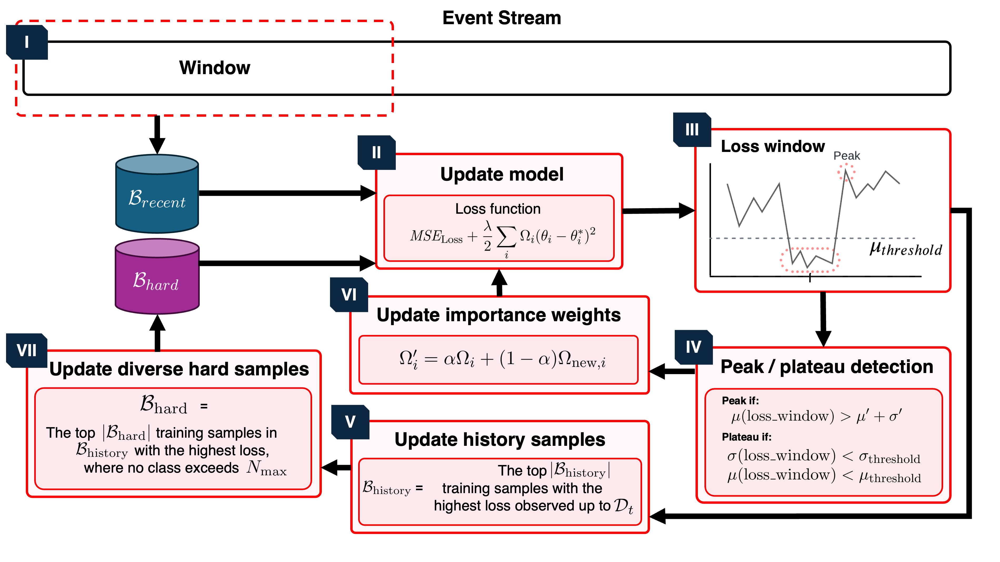

# TFCLPM

This is the official GitHub repository for Task-Free diversity-aware Continual Learning for predictive Process Mining (TFCLPM). 



## Datasets

All the datasets provided in the paper can be downloaded from the following [Google Drive link](https://drive.google.com/drive/folders/1HT0_BM1AvMBQOpQglEH8xoT7NiiSaqVG?usp=share_link). After downloading, locate the .csv files in the 'Data' folder.

## Hyperparameter Setup for Baselines
### Window Size

Methods with (*) use a fixed window size that was provided by the paper. The other baselines' values arise from hyperparameter tuning on the validation set (first 15% of the data stream).

| Dataset | w = Last Drift [12] (*) | w = 1 [12] (*) | DynaTrainCDD [6] (*) | Incremental [14] | FullRetrain [14] | DDM [13] (*)|
| :--- | :--- | :--- | :--- | :--- | :--- | :--- |
| **IRO5000** | 1 month | 1 month | $w_{init}=1000, W_k=0.8, W_\lambda=0.25$ | w = 100 | w = 100 | w = 100 |
| **ORI5000** | 1 month | 1 month | $w_{init}=1000, W_k=0.8, W_\lambda=0.25$ | w = 100 | w = 100 | w = 100 |
| **RIO5000** | 1 month | 1 month | $w_{init}=1000, W_k=0.8, W_\lambda=0.25$ | w = 100 | w = 100 | w = 100 |
| **ROI5000** | 1 month | 1 month | $w_{init}=1000, W_k=0.8, W_\lambda=0.25$ | w = 100 | w = 100 | w = 100 |
| **OIR5000** | 1 month | 1 month | $w_{init}=1000, W_k=0.8, W_\lambda=0.25$ | w = 100 | w = 100 | w = 100 |
| **InternationalDeclarations** | 1 month | 1 month | $w_{init}=1000, W_k=0.8, W_\lambda=0.25$ | w = 500 | w = 100 | w = 100 |
| **DomesticDeclarations** | 1 month | 1 month | $w_{init}=1000, W_k=0.8, W_\lambda=0.25$ | w = 500 | w = 100 | w = 100 |
| **RequestForPayment** | 1 month | 1 month | $w_{init}=1000, W_k=0.8, W_\lambda=0.25$ | w = 100 | w = 100 | w = 100 |
| **BPIC 2017** | 1 month | 1 month | $w_{init}=100, W_k=0.8, W_\lambda=0.25$ | w = 100 | w = 100 | w = 100 |
| **BPIC 2015** | 1 month | 1 month | $w_{init}=100, W_k=0.8, W_\lambda=0.25$ | w = 500 | w = 100 | w = 100 |
| **HelpdeskDrift** | 1 month | 1 month | $w_{init}=1000, W_k=0.8, W_\lambda=0.25$ | w = 500 | w = 100 | w = 100 |
| **RecurrentRequest** | 1 month | 1 month | $w_{init}=100, W_k=0.8, W_\lambda=0.25$ | w = 100 | w = 100 | w = 100 |

### Additional Parameters
- **w = Last Drift [12]:** learning rate = 0.002, batch size = 32, epochs = 10
- **w = 1 [12]:** learning rate = 0.002, batch size = 32, epochs = 10
- **DynaTrainCDD [6]:** Number of prefix trees = 10, learning rate = 0.002, batch size = 32, epochs = 10
- **Incremental [14]:** learning rate = 0.002, batch size = 32, epochs = 10
- **FullRetrain [14]:** learning rate = 0.002, batch size = 32, epochs = 5
- **DDM [13]:** learning rate = 0.002, batch size = 32, epochs = 10


## Installation
To install the required libraries, run the following command in your terminal:

```
pip install -r requirements.txt
```

## Command-Line Arguments

This script accepts several command-line arguments:

```
--dataset| "Data/RecurrentRequest.csv" | Path to the dataset (CSV file). 
--method | str | "TFCLPM" | Prediction method to use. 
--recent_buffer_size | int | 500 | Recent buffer size.
--hard_buffer_size | int | 100 | Hard buffer size.
--history_buffer_size | int | 300 | History buffer size.
--MAS_weight | float | 0.5 | MAS weight.
--history_buffer | bool | True | Whether to use history buffer (True/False).
--repetitions | int | 5 | Number of repetitions.
```

## **Example Usage**
```
python Model/main.py --dataset "Data/HelpdeskDrift.csv"
```

Note that if you want to exclude the Hard Buffer, you need to uncomment 'Online Continual No Hardbuffer' instead of 'Online Continual'.

